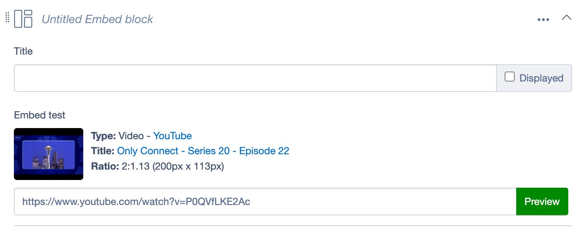
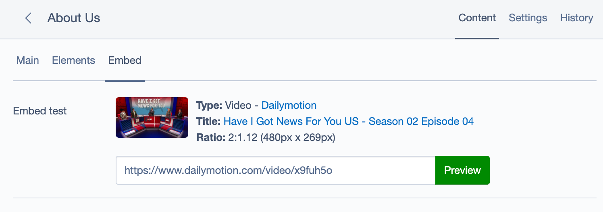

SilverStripe Embed Field
===================================

This field is designed to let users attached an oembed object (eg a YouTube video) to a page or dataobject.  It stores the oembed result information in an EmbedObject for easy access from the template (or wherever you want it).

This originally built upon the work of [SilverStripe Embed Field nathancox/embedfield](https://github.com/nathancox/silverstripe-embedfield) which had been quiet for several years.

**As of v4.1 the field has been converted to a React-driven form field, enabling use inline in Elemental blocks.**

Requirements
------------
* SilverStripe 5.0+

Installation Instructions
-------------------------

1. Install with composer `composer require fromholdio/silverstripe-embedfield`
2. Visit yoursite.com/dev/build to rebuild the database

Usage Overview
--------------

Make a has_one relationship to an EmbedObject then create an EmbedField in getCMSFields:

```php
namespace {

    use SilverStripe\CMS\Model\SiteTree;
    use Fromholdio\EmbedField\Model\EmbedObject;
    use Fromholdio\EmbedField\Forms\EmbedField;

    class Page extends SiteTree
    {
        private static $db = [];

        private static $has_one = [
            'MyVideo' => EmbedObject::class
        ];
        
        public function getCMSFields() {
            $fields = parent::getCMSFields();
            
            $fields->addFieldToTab('Root.Main', EmbedField::create('MyVideoID', 'Sidebar video'));
            
            return $fields;
        }
    }
}
```

In the page template the video can now be embedded with `$MyVideo`.

### Form field screenshots

* User inputs URL, and can click Preview to retrieve embed meta information (or learn the URL is invalid)
* On save, if valid, embed data is retrieved and saved into an `EmbedObject`, attached to the has_one populating the field
* On load, if EmbedObject exists, the embed meta preview is automatically displayed 

#### Inline Elemental



#### Regular Page CMS fields


